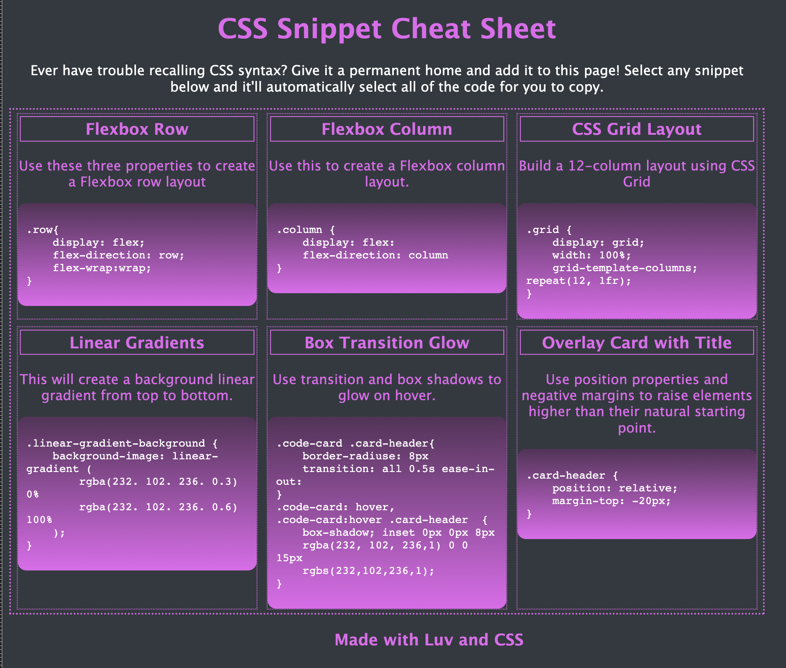
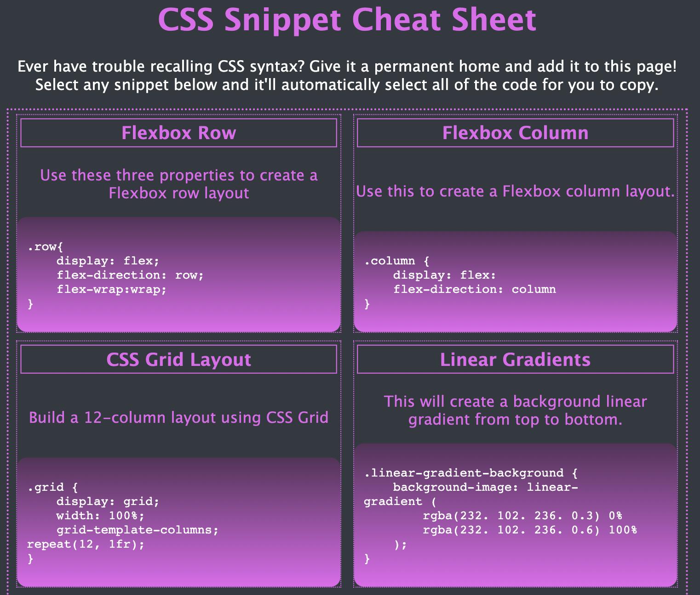
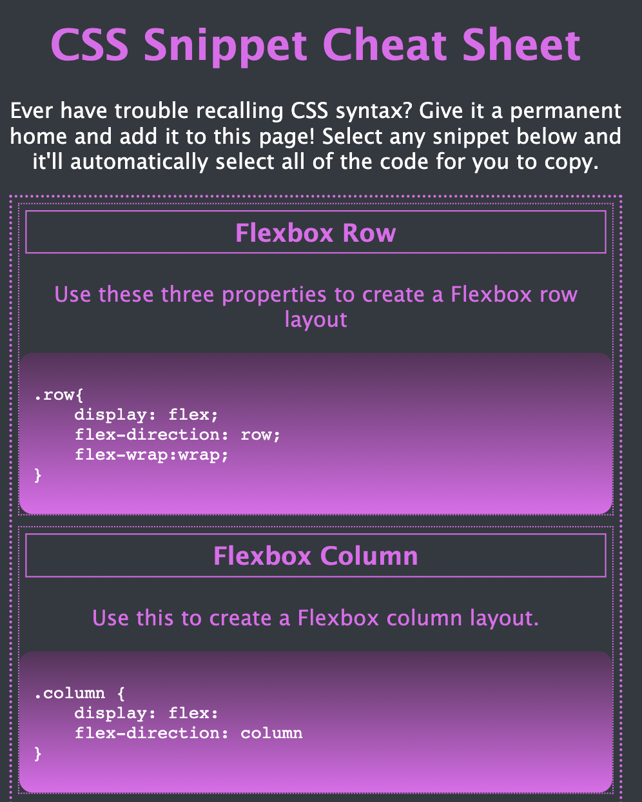

# Demo CSS Cheat Sheet
A single-page CSS Cheat Sheet created as a bootcamp student mini-project

## Description

Provide a short description explaining the what, why, and how of your project. Use the following questions as a guide:

- What was your motivation?
- Why did you build this project? (Note: the answer is not "Because it was a homework assignment.")
- What problem does it solve?
- What did you learn?

Project created as a practical demonstration of advanced CSS concepts presented in Bootcamp, including building responsive web pages (flexbox and media queries), pseudo-classes, pseudo-elements, wireframes, CSS variables and basic animations.

## Table of Contents (Optional)

- [Deployment](#deployment)
- [Usage](#usage)
- [Screenshots](#screenshots)
- [License](#license)
- [Features](#features)

## Deployment

[Visit Webpage](https://iseanc.github.io/demo-css-cheatsheet/)

## Usage

Hover the mouse over a code snippet and click on it to select it.  Copy it to your clipboard and paste into a code editor or other location.

## Screenshots

## License

This repo uses The Unlicense.

## Badges

## Features

- Uses CSS Flexbox and Media Queries to adjust page layout on multiple screen widths
- Click a code snippet to highlight all the text at once for easy copying to the clipboard.
- Click any card and the border lights up to show it's been selected.